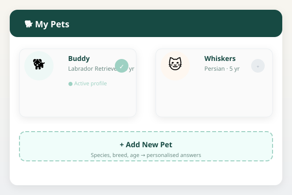
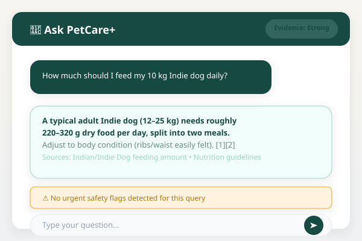
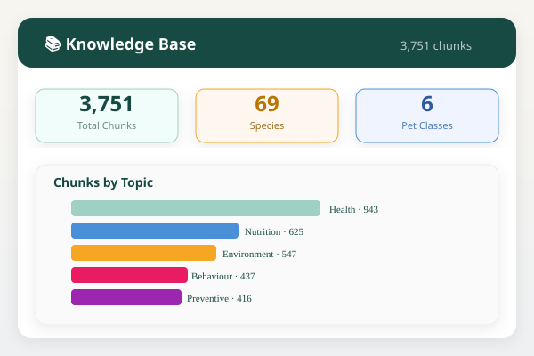
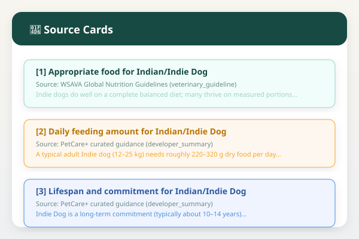
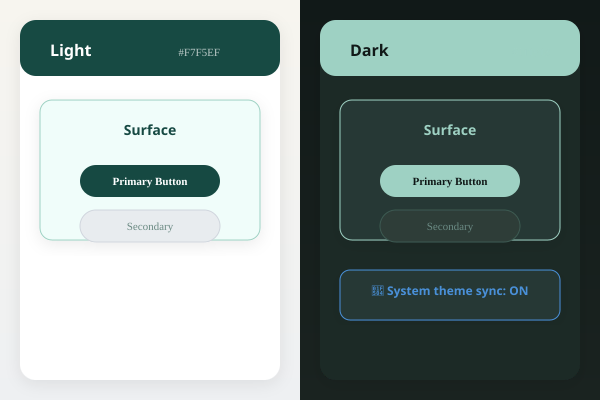
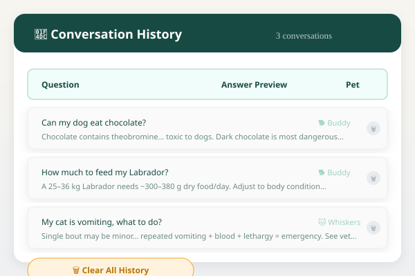

<p align="center">
  
</p>


<p align="center">
  <a href="https://www.python.org/downloads/"></a>
  <a href="https://pytorch.org/"></a>
  <a href="https://pyside.org/"></a>
  <a href="https://huggingface.co/BAAI/bge-small-en-v1.5"></a>
  <a href="https://huggingface.co/Qwen/Qwen2.5-1.5B-Instruct"></a>
</p>


<p align="center">
  <strong>🐾 Evidence-grounded, 100% offline pet-care guidance for 70 species — running entirely on your Windows machine.</strong>
</p>


<p align="center">
  <a href="#-quick-start"></a>
  <a href="#-features"></a>
  <a href="#-supported-pets"></a>
</p>


---

## 🌟 Why PetCare+?

| 🔒 **Private by Design** | 💰 **Zero API Cost** | 📴 **Fully Offline** | 📚 **Cited, Not Hallucinated** | ⚠️ **Safety First** |
|:---:|:---:|:---:|:---:|:---:|
| All data stays on your D: drive — pets, history, settings are plain JSON | No OpenAI, Anthropic, or cloud bills — everything runs locally | Works without internet after one-time model download | Every claim has a `[n]` citation linking to a real retrieved source | Built-in safety layer flags emergencies (poisoning, GDV, blocked cat, etc.) |

---

## 🚀 Quick Start

### Prerequisites
- **Windows 10/11** (PowerShell 5.1+)
- **Python 3.10+** — [Download](https://www.python.org/downloads/windows/)
- **Git** — [Download](https://git-scm.com/download/win)

### One-Command Setup
```powershell
# Clone and enter (replace YOUR_USERNAME with your GitHub username)
git clone https://github.com/YOUR_USERNAME/petcareplus.git
cd petcareplus

# Run the automated setup (downloads models, builds KB, installs deps)
Set-ExecutionPolicy -Scope Process -ExecutionPolicy Bypass
.\setup_windows.ps1
```

That's it! The script will:
1. ✅ Create virtual environment (`.venv`)
2. ✅ Install all Python dependencies
3. ✅ Download embedding model (~380 MB) → `models/embeddings/`
4. ✅ Download generation model (~1.2 GB) → `models/llm/`
5. ✅ Build knowledge base + FAISS index (3,751 chunks)
6. ✅ Verify everything works

### Launch
```powershell
.\run_petcare.bat
```

> **Skip LLM download?** Set `$SkipLLM = $true` in `setup_windows.ps1` — the app works in retrieval-only mode.

---

## ✨ Features

<div align="center">

| 🏠 **Home Dashboard** | 🐕 **Pet Profiles** | 💬 **Chat with Citations** | 📚 **Knowledge Browser** |
|:---:|:---:|:---:|:---:|
|  |  |  |  |
| Logo, quick actions, theme toggle | Add/edit pets (species, breed, age) | Streaming answers with `[n]` source cards | Search 3,751 curated chunks |

| 🔍 **Source Cards**  | 🌓 **Live Theming** | 📜 **History** |
|:---:|:---:|:---:|
|  |  |  |
| Full chunk text, authority badge | Light/Dark/System + model path | Instant switch, OS-follow | Per-turn delete + clear all |

</div>

### Core Capabilities
- 🧠 **Hybrid Retrieval**: BGE-small dense (FAISS, cosine) + BM25 → RRF (k=60) + metadata boost
- 🎯 **Species/Breed/Age-Aware**: Queries automatically routed to relevant chunks
- 🇮🇳 **India-Specific**: Rabies, monsoon, festival noise, heat guidance woven throughout
- 📊 **Confidence Scoring**: Evidence strength badge on every answer
- ♿ **Accessible**: Keyboard navigation, high-contrast themes, screen-reader friendly

---

## 🐾 Supported Pets (70 Species)

<details>
<summary><strong>🐶 Dogs (22)</strong> — click to expand</summary>

| Breed | Size | Notable Traits |
|-------|------|----------------|
| Indian/Indie Dog | Medium | Hardy, heat-adapted, great adoptee |
| Labrador Retriever | Large | Food-motivated, family-friendly |
| Golden Retriever | Large | Gentle, prone to skin allergies |
| German Shepherd | Large | Loyal, working drive, joint care |
| Indian Spitz / Pomeranian | Small | Apartment-friendly, vocal |
| Shih Tzu | Small | Brachycephalic, needs cooling |
| Beagle | Medium | Scent hound, escape artist |
| Rottweiler | Large | Confident, needs experienced handling |
| Dachshund | Small | IVDD risk, protect the spine |
| Pug | Small | Extreme heat intolerance |
| **English Bulldog** | Medium | Brachycephalic, fold care critical |
| **Boxer** | Large | Playful, bloat risk |
| **Standard Poodle** | Large | Hypoallergenic coat, smart |
| **Siberian Husky** | Medium | Cold-adapted, escape artist |
| **Doberman Pinscher** | Large | Athletic, cardiac screening |
| **Cocker Spaniel** | Medium | Floppy ears → infections |
| **Border Collie** | Medium | Extreme mental needs |
| **Chihuahua** | Tiny | Tracheal collapse risk |
| **Yorkshire Terrier** | Tiny | Dental care critical |
| **Dalmatian** | Medium | Urate stone predisposition |
| **Jack Russell Terrier** | Small | High drive, secure fence needed |
| **Cane Corso** | Large | Guardian breed, experienced handling needed |

</details>

<details>
<summary><strong>🐱 Cats (10)</strong></summary>

| Breed | Key Notes |
|-------|-----------|
| Domestic Shorthair | Hardy, great adoptee |
| Persian | Brachycephalic, PKD screening |
| Maine Coon | Large, HCM screening |
| Siamese | Vocal, social, dental care |
| Bengal | High energy, enrichment needed |
| **Ragdoll** | Docile, HCM screening |
| **British Shorthair** | Calm, obesity prone |
| **Sphynx** | Hairless, weekly baths, warmth |
| **Exotic Shorthair** | Flat face, PKD, eye care |
| **Scottish Fold** | Osteochondrodysplasia risk |

</details>

<details>
<summary><strong>🐹 Small Mammals (9)</strong></summary>

Rabbit • Guinea Pig • Syrian Hamster • **Fancy Rat** • **Chinchilla** • **House Mouse** • **Gerbil** • **Hedgehog** • **Ferret**

</details>

<details>
<summary><strong>🐦 Birds (9)</strong></summary>

Budgerigar • Cockatiel • Lovebird • Indian Ringneck • **Canary** • **Zebra Finch** • **African Grey** • **Green-cheeked Conure** • **Blue-and-Gold Macaw**

</details>

<details>
<summary><strong>🐠 Fish (13)</strong></summary>

Goldfish • Betta • Guppy • Molly • Platy • Angelfish • **Neon Tetra** • **Discus** • **Convict Cichlid** • **Bristlenose Pleco** • **Swordtail** • **Dwarf Gourami** • **Oscar**

</details>

<details>
<summary><strong>🦎 Reptiles (7)</strong></summary>

Freshwater Turtle • Bearded Dragon • **Leopard Gecko** • **Corn Snake** • **Ball Python** • **Indian Star Tortoise** • **Veiled Chameleon**

</details>

---

## 🏗 Architecture

```mermaid
flowchart TD
    A[User Query] --> B[Query Understanding]
    B --> C{Safety Layer}
    C -->|Urgent| D[Emergency Banner + Vet Directive]
    C -->|Caution| E[Caution Banner]
    C -->|Safe| F[Hybrid Retrieval]
    F --> G[FAISS Dense (BGE-small, cosine)]
    F --> H[BM25 Lexical (Okapi BM25)]
    G & H --> I[RRF Fusion (k=60)]
    I --> J[Metadata Boost (species/breed/stage)]
    J --> K[Context Builder (dedupe + rerank)]
    K --> L[Local LLM (Qwen2.5-1.5B-Instruct)]
    L --> M[Streaming Answer with [n] Citations]
    M --> N[UI: Safety Banner + Source Cards + Confidence Badge]
```

| Component | Technology | Purpose |
|-----------|------------|---------|
| **Embeddings** | BGE-small-en-v1.5 | 384-dim dense vectors |
| **Vector Index** | FAISS `IndexFlatIP` | Cosine similarity search |
| **Lexical Search** | BM25 (Okapi) | Keyword matching |
| **Fusion** | Reciprocal Rank Fusion | Best of both worlds |
| **Generation** | Qwen2.5-1.5B/3B-Instruct | Local LLM, 4-bit on GPU |
| **UI** | PySide6 (Qt 6.11) | Native Windows desktop |

---

## 📁 Project Structure

```
petcareplus/
├── app/                    # Application source
│   ├── config.py           # Paths, constants, model config
│   ├── rag/                # RAG pipeline
│   │   ├── embeddings.py   # BGE-small wrapper
│   │   ├── knowledge.py    # Chunk loading
│   │   ├── retrieval.py    # FAISS + BM25 + RRF
│   │   ├── context.py      # Context building + dedupe
│   │   ├── query_understanding.py  # Species/breed/stage detection
│   │   ├── safety.py       # Urgent/caution detection
│   │   ├── generation.py   # Local LLM streaming
│   │   └── engine.py       # Orchestrates everything
│   ├── storage/            # Local JSON storage
│   ├── safety/             # Safety assessment
│   └── ui/                 # PySide6 components
├── developer/              # Knowledge base builder
│   ├── kb_generators.py    # 70 species × grid + depth layers
│   └── build_kb.py         # Build knowledge.jsonl + FAISS
├── evaluation/             # 25 curated test questions
├── tests/                  # 13 unit tests
├── docs/                   # Additional documentation
├── assets/                 # README images (banner, screenshots)
├── setup_windows.ps1       # One-time automated setup
├── run_petcare.bat         # Launch script
├── requirements.txt        # Python dependencies
├── pyproject.toml          # Project metadata
├── LICENSE                 # GPL-3.0-or-later
└── README.md               # This file
```

> **Large assets excluded** (downloaded at setup):
> - `models/` — embedding + LLM models (~1.6 GB)
> - `knowledge/index.faiss` — FAISS index
> - `knowledge/knowledge.jsonl` — 3,751 chunks
> - `data/` — user pet profiles & history
> - `huggingface/` — HF cache

---

## 🧪 Evaluation & Tests

```powershell
# Retrieval + Safety + Citation quality (25 questions)
$env:PYTHONPATH = "$PWD"
.venv\Scripts\python.exe evaluation/evaluate.py

# Unit tests (13 tests)
.venv\Scripts\python.exe -m pytest tests -q
```

**Current Results:**
- ✅ **25/25 evaluation questions pass** — 100% retrieval recall, 100% safety accuracy, 100% citation accuracy
- ✅ **13/13 unit tests pass**

---

## 🛠 Development

### Rebuild Knowledge Base
```powershell
$env:PYTHONPATH = "$PWD"
.venv\Scripts\python.exe developer/build_kb.py
# → knowledge/knowledge.jsonl + knowledge/index.faiss (3,751 chunks)
```

### Add a New Species
1. Edit `developer/kb_generators.py` → `SPECIES_DATA`
2. Add condition entries to `CONDITION_INFO` if needed
3. Register in `app/rag/species_registry.py` → `SPECIES` + `GENERIC_CLASS_KEYWORDS`
4. Run `build_kb.py` → verify with `evaluate.py`

---

## ⚠️ Disclaimer

> **PetCare+ is a decision-support tool, not a veterinarian.** For anything urgent — difficulty breathing, collapse, seizures, suspected poisoning, blocked urethra, heatstroke, or possible rabies exposure — contact a professional immediately. The safety layer is heuristic (keyword-based) and may miss or over-flag; treat it as a prompt to seek care, not a diagnosis.

The knowledge base is **developer-curated and synthesised** from openly available authoritative guidance (WSAVA, Merck Veterinary Manual, AVMA, AWBI, DAHD, NCDC, etc.). It is not a substitute for primary literature and should be refreshed periodically.

---

## 📄 License

**Code:** [GPL-3.0-or-later](LICENSE)
**Knowledge Content:** Developer-curated synthesis of openly available authoritative veterinary guidance; see per-chunk `source`/`license` metadata.

---

<p align="center">
  <sub>Built with ❤️ for pet parents everywhere — <a href="https://github.com/petcareplus/petcareplus">PetCare+ on GitHub</a></sub>
</p>
